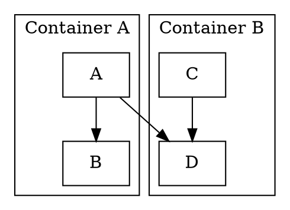

[Jepack Compose](https://developer.android.com/jetpack/compose) is two things - a smart tree management solution and a UI toolkit built on top of that tree management solution. 

Jake Wharton sums it up well in his [article](https://jakewharton.com/a-jetpack-compose-by-any-other-name/) pushing for naming both these components differently and I agree.

> What this means is that Compose is, at its core, a general-purpose tool for managing a tree of nodes of any type. Well a “tree of nodes” describes just about anything, and as a result Compose can target just about anything.

Originally built for Android, it has already crossed boundaries into [Desktop](https://www.jetbrains.com/lp/compose/), [Web](https://blog.jetbrains.com/kotlin/2021/05/technology-preview-jetpack-compose-for-web/) and recently even [command line](https://github.com/JakeWharton/mosaic)(!) thanks to Kotlin Multiplatform and tree management abstraction.

While all of them are UI, I wanted to try and explore Compose's tree management capabilities for a non UI use case.

### What we will build?

Code generation is undeniably a common use case in software development and usually done via generation libraries like [JavaPoet](https://github.com/square/javapoet) or [KotlinPoet](https://github.com/square/kotlinpoet) so that we have sufficient type safety and safeguard around corner cases. 

In this article, we utilise Jetpack Compose's tree management capabilities to generate code for GraphViz's `dot` file format. I already have one [implementation](https://github.com/arunkumar9t2/scabbard/tree/main/dot-dsl) of `dot` file generation using DSLs in one of my other [projects](https://arunkumar9t2.github.io/scabbard/) so it lets me draw parallels and compare how Jetpack Compose might help here.

The final solution might look like below

```kotlin
DirectedGraph("Hello") {
  node {
    "shape" `=` "rectangle"
  }
  Cluster("Container A") {
    "A" link "B"
  }
  Cluster() {
    "C" link "D"
  }
  "A" link "D"
}
```
that generates the following `.dot` file.







### Code Generation

Programming language source codes are usually represented as an [Abstract Syntax Tree](https://en.wikipedia.org/wiki/Abstract_syntax_tree) in various phases be it during compilation, IDE support, editing etc. Each node of that tree represents important bits of information like keywords and identifiers etc. 

Lets consider the following function

```kotlin
fun sum(a: Int, b: Int): Int {
    println("Calculating sum")
    return a + b
}
```

Assuming a `Statement` interface serving as the tree `Node` type and respective subclasses for functions, assigment etc, the above can be represented as shown below. Specific details like parantheses are omitted for brevity.

```
FunctionStatement (sum)
    ├── FunctionStatement (println)
    └── ReturnStatement (return)
        └── AssignmentStatement (a + b)
            ├── IdentifierStatement (a)
            ├── OperatorStatment (+)
            └── IdentifierStatement (b)
```

Since Compose works so well with construction and managing of trees it should be possible to construct tree of `Statement`s shown above with just `@Composable` functions and then generate source code with resultant `Tree<Statement>` that Compose manages.

### Jetpack Compose Compiler

Before we jump into implementing such `@Composable` functions, I want to touch base on Compose Compiler and highlight few behaviors from a non UI point of view. Compose compiler plugin helps in adding/removing/moving tree nodes via pure function calls. For example, consider:

```kotlin
Function¹ {
    Function²()
    Return()
}
```
Adds nodes emitted by `Function²()` and `Return()` as children to root node `Function¹()`. This is automatically done without any `add()` statments, fluent builders or factories with only lexical information thanks to the compiler plugin. [Leland Richardson](https://twitter.com/intelligibabble) explains why and how in [this excellent article](http://intelligiblebabble.com/compose-from-first-principles/).

#### Applier, Composition and Compose Nodes 

Compose has few APIs that allows us to add capabilties to manage tree of any type. 

##### Applier

The entry point to this is the `Applier` [interface](https://cs.android.com/androidx/platform/frameworks/support/+/androidx-main:compose/runtime/runtime/src/commonMain/kotlin/androidx/compose/runtime/Applier.kt) which will be used by Compose compiler plugin to modify the tree. We have full freedom to choose the tree implementation of our choice, the `Applier` abstraction simply gives callbacks at the right places to modify the tree way we want.

A simple implementation of `Applier` that can add nodes to a tree looks like below.

```kotlin
class Node {
  val children = mutableListOf<Node>()
}

class NodeApplier(node: Node) : AbstractApplier<Node>(node) {
  override fun onClear() {}
  override fun insertBottomUp(index: Int, instance: Node) {}

  override fun insertTopDown(index: Int, instance: Node) {
    current.children.add(index, instance) // `current` is set to the `Node` that we want to modify.
  }

  override fun move(from: Int, to: Int, count: Int) {
    current.children.move(from, to, count)
  }

  override fun remove(index: Int, count: Int) {
    current.children.remove(index, count)
  }
}
```
`Applier` is only used to mutate the tree, but we still don't have a way to connect them with `@Composables`. Once we have the `Applier`, we need to create a `Composition` root so that other `@Composable` functions can be called. To put it simply, `@Composable` can be called only inside a `@Composable` function and `Composition` function helps in initating the root composition.

##### Composition

To create a `Composition` we use `fun Composition(applier: Applier<*>, parent: CompositionContext)`, which takes the applier instance we created above.


To create the root composition:
```kotlin
val composition = Composition(
    applier = NodeApplier(node = Node()),
    parent = Recomposer(Dispatchers.Main)
)
composition.setContent {
    // Composable function calls
}
```
Notable things here are creating the `Applier` with root node and passing a `Recomposer` instance. `Recomposer` is used for recomposition when the tree changes, since we are dealing with static tree in this article details around it are omitted for brevity but may be covered in a future post.

Once we have the root `Composition` we have a space to call `@Composable` functions.

##### Compose Node

Even though we have a root `Composition` to call `@Composable` functions this does not mean that any `@Composable` can be called here and doing so would result in `RuntimeException` if the `Applier` type did not match. 

###### Creating Composable Functions

To place a node in the composition tree, we use `ComposeNode` function, a `@Composable` function. It takes the `Applier` type (should be the same one used in `Composition` earlier), factory functions and a updator function. 

For the `Node` and `NodeApplier` the `ComposeNode` might look like below:

```kotlin
@Composable
fun Root(content: @Composable () -> Unit) {
  ComposeNode<Node, NodeApplier>(
    factory = { Node() },
    update = {},
    content = content
  )
}
```

The call site for this function looks like `Root {}` similar to inbuilt composables. Invoking this function multiple times *emits* child nodes in the tree at right places.

Now that we have basic idea of how to connect `@Composable` function calls to a Tree type, in the remainder of the article we explore how to build `dot` language composables.

### Expressing Dot format as @Composables

In my earlier [implementation](https://github.com/arunkumar9t2/scabbard/blob/81f6acb1366dd59fad91f299a808574f00bbe437/dot-dsl/src/main/kotlin/dev/arunkumar/dot/dsl/DotGraphBuilder.kt) of DSL, I had basic abstraction root as a `DotGraph : Statement` interface that can hold a children of `Statement`s. Then extensions functions with infix and trailing lamda allows to build the tree without superflous statements like `add()` etc.

A `digraph "name" {}` statement can be abstracted as shown below.

```kotlin
class DotGraph(private val header: String) : Statement() {

  private val elements: MutableList<Statement> = mutableListOf()

  fun add(statement: Statement) {
    elements.add(statement)
  }

  override fun write(level: Int, writer: PrintWriter) {
    indent(level, writer)
    writer.println("$header {")
    for (element in elements) {
      element.write(level + 1, writer)
    }
    indent(level, writer)
    writer.println("}")
  }
}
```
The `Statement` impls can be anything, even children `DotGraphs`. I wanted to find a balance between doing everthing in compose vs earlier DSL. For instance, every statement in `dot` can be a node in the Composition tree similar to ASTs but that meant there will limited control and less flexibility compared to `infix` functions. 

So the balance I settled for was to use `Compose` to manage a tree of `DotGraph`s and use traditional recievers to write dot statments like attributes etc into those `DotGraph` instances.

Without Compose or DSL, the tree can be constructed as follows

```kotlin
DotGraph("digraph \"Hello\"").apply {
  add(DotStatement("node").apply {
    "shape" `=` "rectangle"
  })
  add(DotGraph("subgraph \"cluster_Container A\"").apply {
    add(DotStatement("graph").apply {
      "label" `=` "Container A"
    })
    add(DotEdge("A", "B"))
  })
}
```

With existing constructs, let's proceed to see how this can be cleaned up with Compose.

#### Composition and ComposeNodes

The `Applier` implementation for `DotGraph` is left as an excercise for the reader.

As mentioned earlier, I wanted to balance between Compose and traditional Kotlin constructs to add statements. Inspired by existing Compose usage of `Scope` interfaces to denote a Kotlin lamdba with receivers ([DrawScope](https://developer.android.com/reference/kotlin/androidx/compose/ui/graphics/drawscope/DrawScope), [BoxScope](https://developer.android.com/reference/kotlin/androidx/compose/foundation/layout/BoxScope)), I setup a `DotGraphScope` which can be attached as a Kotlin receiver to `@Composable` functions. Since every Composable callback will have this instance implicitly, it gives us place to add `infix` functions and other helpful methods. 

```kotlin
@DslMarker
annotation class DotDslScope

@DotDslScope
inline class DotGraphScope(val dotGraph: DotGraph) {

  inline operator fun String.invoke(nodeBuilder: DotNode.() -> Unit = {}): String {
    dotGraph.add(DotNode(this).apply(nodeBuilder))
    return this
  }

  infix fun String.link(target: String): EdgeBuilder {
    val dotEdge = DirectedDotEdge(this, target).also(dotGraph::add)
    return EdgeBuilder(dotEdge)
  }
  
  // ----
}

```

I chose to create a `DirectedGraph` function that will create the root composition instance and provide a `@Composable` lambda to call other composable functions.

```kotlin
fun DirectedGraph(
  name: String,
  parent: Recomposer = Recomposer(Dispatchers.Main),
  content: @Composable DotGraphScope.() -> Unit
): Pair<DotGraph, Composition> {
  val rootDotGraph = DotGraph("digraph ${name.quote}")

  val applier = DotStatementApplier(rootDotGraph = rootDotGraph)
  val composition = Composition(applier = applier, parent = parent)
  composition.setContent {
    content(DotGraphScope(rootDotGraph))
  }
  return applier.root as DotGraph to composition
}
```

The `setContent` call kicks of the composition. I should note that it might be useful to retain the `Composition` instance hence the method returns both the root node of the tree and the `Composition`.

##### Graph Composables

Our current intention is to replace `add(DotGraph())` with `Cluster {}` and replace `add(DotStatement())` with infix functions, the latter is already done as part of `DotGraphScope`. As we learnt earlier, adding a node is as simple as a function call, so we could create a cluster composable that emits a `ComposeNode` of type `DotGraph` and registers a composable callback for its content.

```kotlin
@Composable
fun SubGraph(name: String, content: @Composable DotGraphScope.() -> Unit) {
  val dotGraph = DotGraph("subgraph $name")
  ComposeNode<DotGraph, DotStatementApplier>(
    factory = { dotGraph },
    update = {},
    content = {
      content(DotGraphScope(dotGraph))
    }
  )
}

@Composable
fun Cluster(name: String, content: @Composable DotGraphScope.() -> Unit) {
  SubGraph("cluster_$name".quote) {
    content()
  }
}
```

Ideally the `dotGraph` should be constructed inside the `factory` but I cheated there a bit since I needed to use that instance below. This could be explored in a future article when tree mutability is explored.

### Results

Connecting all together, we have `DirectedGraph` function to kick start the composition and set of `@Composable`s to construct the source code we intend to generate. Comprehensive example below:

```kotlin
DirectedGraph("Hello") {
  node {
    "shape" `=` "rectangle"
  }
  Cluster("Container A") {
    "Item 1" link "Item 2"
  }
  Cluster("Container B") {
    "Item 3" link "Item 4"
  }
  Cluster("Container C") {
    "Item 5" {
      "color" `=` "blue"
    }
    Cluster("Inner Container") {
      "Item 6" {
        "color" `=` "red"
      }
    }
  }
  "Item 1" link "Item 4"
  "Item 2" link "Item 5"
  "Item 6" link "Item 3"
}
```

and generated image by passing the `.dot` file to `dot`:



> The entire project setup with Gradle and results can be found [here](https://github.com/arunkumar9t2/compose-dot).

### Compose advantages

`DSL` can also provide similar functionality of constructing such trees but how does it compare against `@Composable` functions? There are some key advantages

1. As shown above adding, moving and removing nodes are operations supported natively by compose. That means converting node operations to `@Composable` automatically adds those guarantees. For example, instead of custom types to host `add()` functions as shown below 
   ```kotlin
   class Builder {
       fun node(builder : Node.() -> Unit)) {
           add(Node().apply(builder))
       }
   }
   ```
   we can create a `@Composable Node()` function that has the capabilities automatically generated by compiler plugin.
2. `@Composable`s are just functions. They are not usually hosted inside class types and forces code to be self contained.
3. Though mutablitity is not covered in this article, it is one of strong features of compose - the ability to do smart updates to tree might be challenging to implement with traditional DSLs. Although possible, it might not be as concise as `@Composable` functions.
4. [State management](https://developer.android.com/jetpack/compose/state). Compose provides property based acces to state and can automatically recompose affected nodes - this can be incredibly useful when needing to modify lot of nodes in response to state changes.
5. `CompositionLocal` - Using `@Composable` functions also unlocks several compose specific features like `CompositionLocal`s. Even though `@Composable`s are static functions, compiler plugin rewrites them into a scope and enables features like state hoisting. Let's say we have a need to transfer some information from parent nodes to children nodes. Using CompositionLocal we can implicitly share this state while retaining benefits of stand alone static functions.
   ```kotlin
    val RootGraphScope = compositionLocalOf<DotGraphScope> { error("Not set") }
    
    DirectedGraph("Hello") {
      CompositionLocalProvider(RootGraphScope provides this) {
        node {
          "shape" `=` "rectangle"
        }
        Cluster("Inner Container") {
          RootGraphScope.current.graph { // access parent scope from children
            "color" `=` "red"
          }
        }
      }
    }
   ```
   Here through use of `CompositionLocal`s it should be possible for childrent to access state from parents. It happens behind the scenes without changing the function signature.

### Future work

While the current solution explores basic tree management, there are still plethora of things I want to explore further like async with coroutines, tree mutation, recompostion and parallel composition etc. Code generation might not be an exact fit for those things though.

Would be glad to hear any feedback/concerns in the comments below, thanks.

- Arun